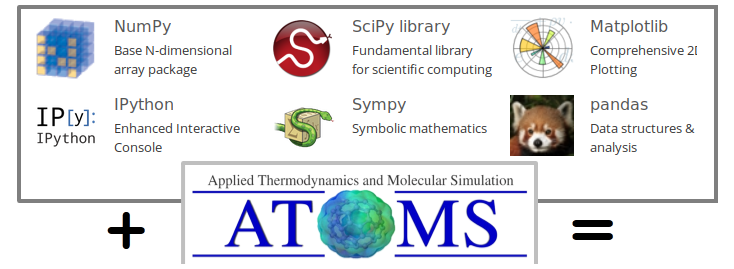
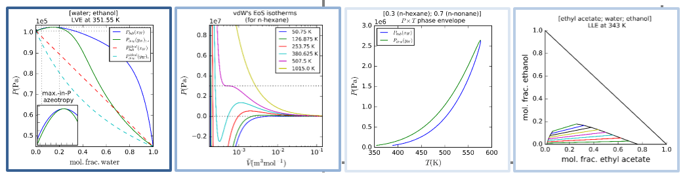
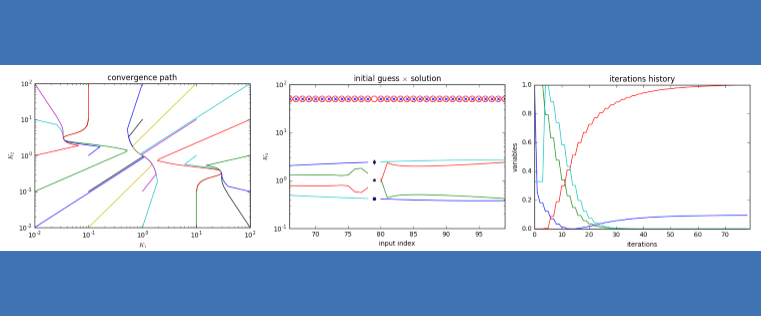
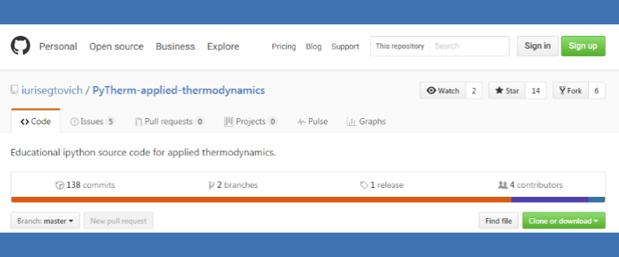
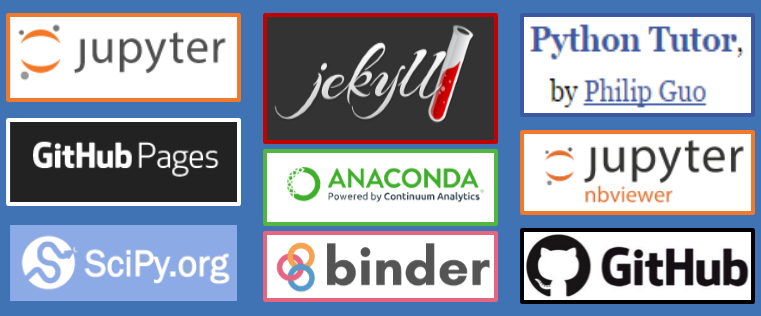

# About the project

* Our main goal is to develop and publish open source interactive computational course materials for students of Applied Thermodynamics and make them widely available.

* We do so on top of the *SciPy* stack -- a Python-based ecosystem of open-source software for mathematics, science, and engineering. *(We are not affiliated with or endorsed by SciPy.org nor all the other great open source platform that we make use of and highlight here in any way.)*

[Click to read more about the project >>](pages/about.md)

# Courseware content

* Find here our courseware content, access in any of the three following ways:

## Read statically

* Reading our material statically in web page format is straightforward from your browser:

[ > Read statically online ](http://nbviewer.jupyter.org/github/{{ site.github.owner_name }}/{{ site.github.repository_name }}/blob/master/index.ipynb)

## Read interactively

 * You can also run our material remotely on myBinder. Try them also from your browser:

[< ! > Check the system status](http://mybinder.org/status)

[ >_ Main lectures - Read interactively](http://mybinder.org:/repo/{{ site.github.owner_name }}/{{ site.github.repository_name }})

## Setup locally

* Download our whole content package, either as zip or as tar.

[< ZIP > Download](http://github.com/{{ site.github.owner_name }}/{{ site.github.repository_name }}/zipball/master)

[< TAR >  Download](http://github.com/{{ site.github.owner_name }}/{{ site.github.repository_name }}/tarball/master)

* To run locally and develop on top of our content, we recommend setting up Python and the SciPy stack using the anaconda distribution.

[Click to read more about setting up locally >>](pages/setup.md)

# Models & algorithms laboratory

* On our models & algorithms laboratory, we intend to publish well documented and open source implementations of topics of interest in thermodynamics for intermediate level students in thermodynamics and in programming / scientific computing, with complete reference to original journal or textbook publications. This way objective quantitative comparison of classic, stated-of-art and newly proposed methodologies is possible.

[Click to read more about our models and algorithms laboratory >>](pages/models-and-algorithms-laboratory.md)

# Scientific packages development incubator

*  On our scientific packages development incubator ee intend to develop research level packages for advanced level graduate students and researchers to fill gaps in the scientific literature of the open source community.

[Click to read more about our scientific packages development >>](pages/software-incubator.md)

# Get involved

* Ours is an open source project in early development stage hosted on the open source community of GitHub. In order to get involved, either reach out via e-mail, or sign up on GitHub and use their collaborative work tools.

[Click to read more about getting involved >>](pages/getinvolved.md)

# Acknowledgements

* This work is currently being developed in [ATOMS][ATOMS-site] - the *laboratory of applied thermodynamics and molecular simulation* of UFRJ, Brazil.

[ATOMS-site]: http://atoms.peq.coppe.ufrj.br

* We would like to acknowledge the platform tools that make this work possible and also some prior and concurrent work that inspire us.

[Click to read on >>](pages/acknowledgements.md)

---

 
